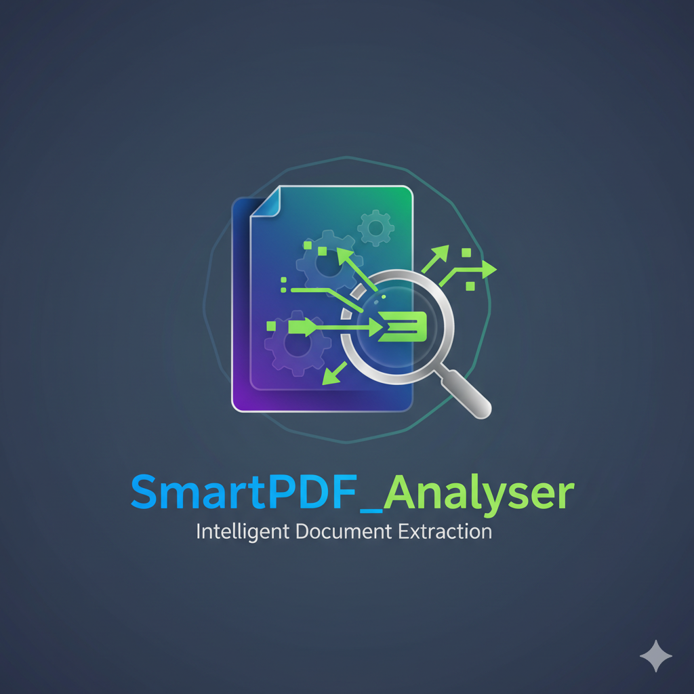

# 📄 SmartPDF_Analyzer



### 🧠 Your Local, Intelligent PDF Summarization & Insight Generator  
**SmartPDF_Analyzer** is a lightweight, offline, rule-based PDF understanding engine with an interactive dashboard built using **Streamlit**.  
It processes any set of PDFs — reports, research papers, menus, travel guides, etc. — and produces **concise, structured summaries** with intelligent section detection and processing time metrics.

---

## 🚀 Features

✅ **Fast & Private** — Works fully offline, no cloud dependencies  
✅ **Multi-PDF Analysis** — Upload multiple documents together  
✅ **Dynamic Summarization** — Automatically adjusts section rules per document  
✅ **Persona & Task Context** — Tailor summaries for your job or persona  
✅ **Report Download** — Export the full report as a text file  
✅ **Built with Lightweight NLP** — No large models, minimal resource usage  

---

## 🧩 Tech Stack

- **Frontend:** Streamlit  
- **Core Engine:** Python (PyMuPDF + NumPy + rule-based summarization)  
- **Summarizer:** Gensim lightweight text rank algorithm  
- **Offline Processing:** 100% local CPU — no external API calls  

---

## 🧱 Project Structure
```
SmartPDF_Analyzer/
│
├── new_main.py # Main File
├── app_dashboard.py # Streamlit dashboard
├── pdf_processor.py # Core processing engine
├── logo.png # App logo
├── requirements.txt # Python dependencies
├── input_config.txt 
└── README.md 
```

---

## ⚙️ Installation

### Clone the repository
```bash
git clone https://github.com/omdhanawat/SmartPDF_Analyzer.git
cd SmartPDF_Analyzer

# Install dependencies
pip install -r requirements.txt

# Run locally
streamlit run app_dashboard.py

